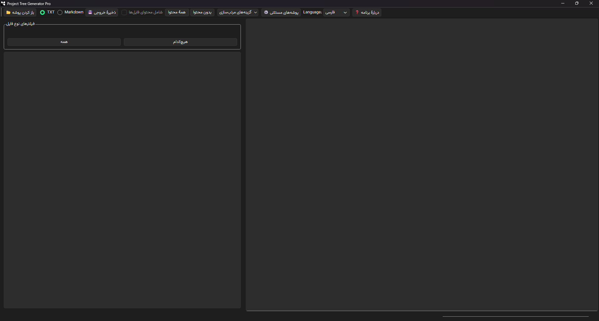
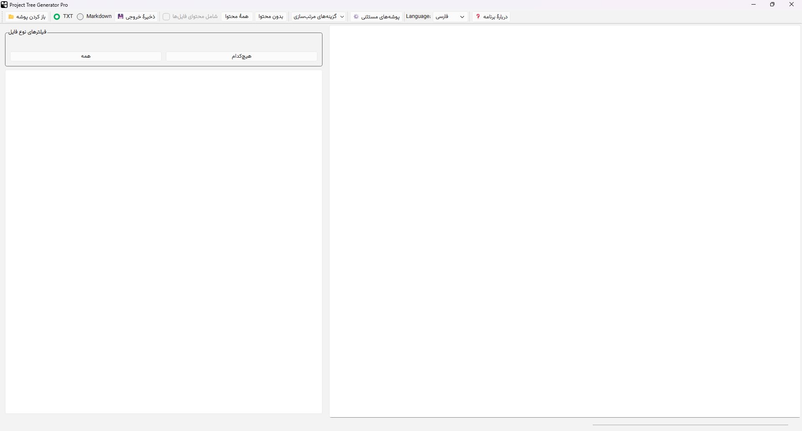

<div dir="rtl" align="center">

# 🌳 Project Tree Generator Pro

[](https://www.python.org/)
[](https://www.qt.io/)
[]()
[](LICENSE)
[]()

**[English](README.md) | [فارسی](README.fa.md)**

---

</div>

## 📖 درباره

یک برنامه دسکتاپ که ساختار درختی فایل‌های پروژه شما را تولید می‌کند. در صورت تمایل می‌توانید محتوای فایل‌ها را هم در خروجی قرار دهید — مناسب برای اشتراک‌گذاری با دستیاران هوش مصنوعی یا هم‌تیمی‌ها.

## ✨ ویژگی‌ها

- 🌲 نمای درختی تعاملی با چک‌باکس
- 📄 خروجی به صورت TXT یا Markdown
- 📦 امکان شامل کردن محتوای فایل‌ها
- 🚫 نادیده گرفتن خودکار `.git`، `node_modules`، `__pycache__` و...
- 🔍 فیلتر کردن فایل‌ها بر اساس پسوند
- 🔄 بررسی خودکار به‌روزرسانی
- 🌐 رابط کاربری فارسی و انگلیسی
- 🎨 هماهنگ با تم تاریک/روشن سیستم (ویندوز و مک)

## 📸 تصاویر

### فارسی

| حالت تاریک | حالت روشن |
|-----------|------------|
|  |  |

## 🚀 نصب

### روش اول: اجرا از سورس (همه پلتفرم‌ها)

این روش روی **Windows**، **macOS** و **Linux** کار می‌کند:

```bash
# Clone the repository
git clone https://github.com/amrezzio/Project-Tree-Generator-Pro.git
cd "Project-Tree-Generator-Pro"

# Create and activate virtual environment
python -m venv .venv

# On Windows:
.venv\Scripts\activate

# On macOS/Linux:
source .venv/bin/activate

# Install dependencies
pip install -r requirements.txt

# Run the application
python src/main.py
```

### روش دوم: دانلود نصب‌کننده (فقط ویندوز)

1. به صفحه [Releases](../../releases/latest) بروید
2. فایل `ProjectTreeGeneratorPro_Setup.exe` را دانلود کنید
3. نصب‌کننده را اجرا کنید
4. از منوی استارت یا دسکتاپ برنامه را باز کنید

> **توجه:** نصب‌کننده‌های macOS و Linux به زودی عرضه می‌شوند. فعلاً از روش سورس در بالا استفاده کنید.

## 🔨 ساخت فایل اجرایی (ویندوز)

```bash
# Activate virtual environment
.venv\Scripts\activate

# Build with PyInstaller
python -m PyInstaller --clean --onedir --windowed \
    --icon=src/app_icon.ico \
    --version-file=version.txt \
    --add-data "src/app_icon.ico;." \
    --add-data "src/translations;translations" \
    --add-data "src/fonts;fonts" \
    src/main.py
```

## 📦 ساخت نصب‌کننده (ویندوز)

از [Inno Setup](https://jrsoftware.org/isinfo.php) استفاده کنید:
1. فایل `setup.iss` را در Inno Setup Compiler باز کنید
2. `Ctrl+F9` را برای کامپایل بزنید
3. نصب‌کننده در پوشه `Release/` ساخته می‌شود

## 🤝 مشارکت

گزارش مشکل و pull request با استقبال مواجه می‌شود.

## 📄 مجوز

MIT License — برای جزئیات بیشتر به فایل [LICENSE](LICENSE) مراجعه کنید.

## 🙏 دست‌اندرکاران

- 💡 ایده از [A-h-hematyar](https://github.com/A-h-hematyar)
- 🤖 توسعه یافته با کمک هوش مصنوعی
- 🔤 [فونت وزیرمتن](https://github.com/rastikerdar/vazirmatn) از صابر راستی‌کردار
- 🎨 ساخته شده با [PySide6](https://www.qt.io/qt-for-python)

---

<div align="center">

ساخته شده با ❤️ توسط [amrezzio](https://github.com/amrezzio)

</div>

</div>