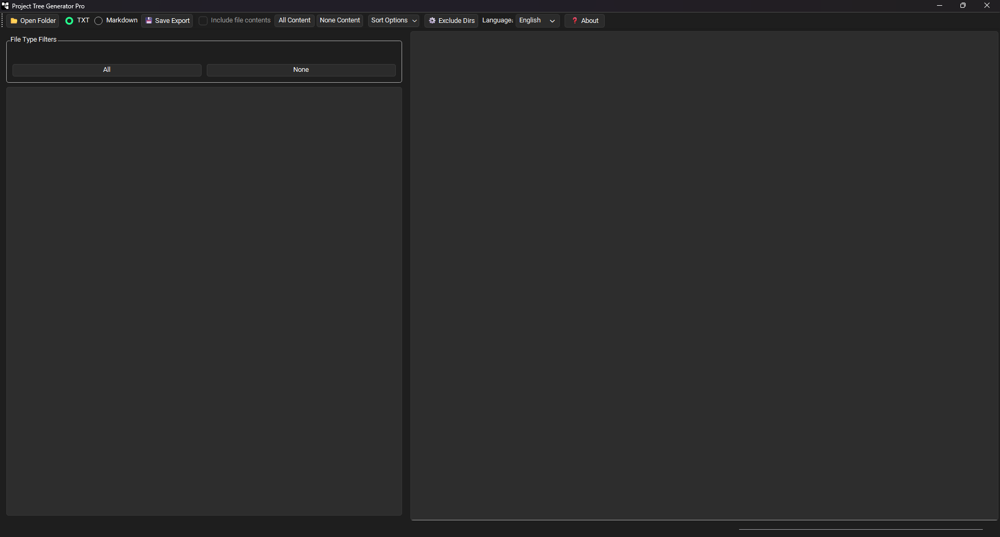
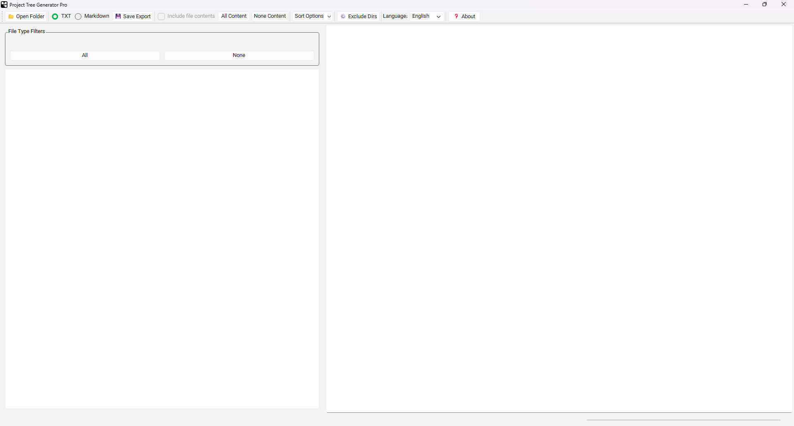

<div align="center">

# 🌳 Project Tree Generator Pro

[](https://www.python.org/)
[](https://www.qt.io/)
[]()
[](LICENSE)
[]()

**[English](README.md) | [فارسی](README.fa.md)**

---

</div>

## 📖 About

A desktop app that generates your project's file tree structure. You can optionally include file contents in the output — useful for sharing with AI assistants or teammates.

## ✨ Features

- 🌲 Interactive tree view with checkboxes
- 📄 Export as TXT or Markdown
- 📦 Option to include file contents
- 🚫 Auto-excludes `.git`, `node_modules`, `__pycache__`, etc.
- 🔍 Filter files by extension
- 🔄 Auto-update check
- 🌐 English and Persian interface
- 🎨 Follows system dark/light theme (Windows & macOS)

## 📸 Screenshots

### English

| Dark Mode | Light Mode |
|-----------|------------|
|  |  |

## 🚀 Installation

### Option 1: Run from Source (All Platforms)

This works on **Windows**, **macOS**, and **Linux**:

```bash
# Clone the repository
git clone https://github.com/amrezzio/Project-Tree-Generator-Pro.git
cd "Project-Tree-Generator-Pro"

# Create and activate virtual environment
python -m venv .venv

# On Windows:
.venv\Scripts\activate

# On macOS/Linux:
source .venv/bin/activate

# Install dependencies
pip install -r requirements.txt

# Run the application
python src/main.py
```

### Option 2: Download Installer (Windows Only)

1. Go to [Releases](../../releases/latest)
2. Download `ProjectTreeGeneratorPro_Setup.exe`
3. Run the installer
4. Launch from Start Menu or Desktop

> **Note:** Installers for macOS and Linux are coming soon. For now, please use the source method above.

## 🔨 Building (Windows)

```bash
# Activate virtual environment
.venv\Scripts\activate

# Build with PyInstaller
python -m PyInstaller --clean --onedir --windowed \
    --icon=src/app_icon.ico \
    --version-file=version.txt \
    --add-data "src/app_icon.ico;." \
    --add-data "src/translations;translations" \
    --add-data "src/fonts;fonts" \
    src/main.py
```

## 📦 Creating Installer (Windows)

Use [Inno Setup](https://jrsoftware.org/isinfo.php):
1. Open `setup.iss` in Inno Setup Compiler
2. Press `Ctrl+F9` to compile
3. Find installer in `Release/` folder

## 🤝 Contributing

Issues and pull requests welcome.

## 📄 License

MIT License — see [LICENSE](LICENSE)

## 🙏 Credits

- 💡 Idea by [A-h-hematyar](https://github.com/A-h-hematyar)
- 🤖 Developed with AI assistance
- 🔤 [Vazirmatn Font](https://github.com/rastikerdar/vazirmatn) by Saber Rastikerdar
- 🎨 Built with [PySide6](https://www.qt.io/qt-for-python)

---

<div align="center">

Made with ❤️ by [amrezzio](https://github.com/amrezzio)

</div>